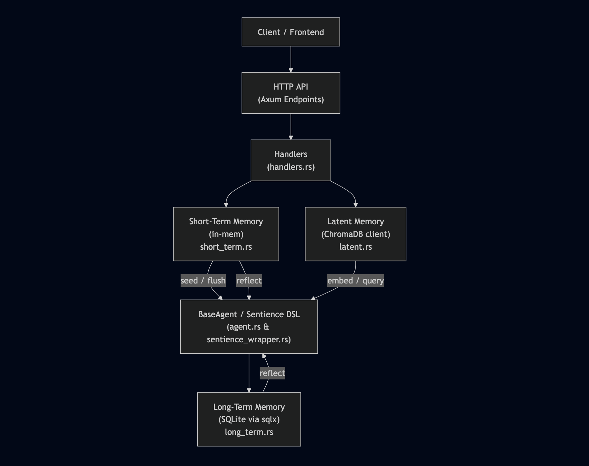

# Inception ICORE Server


> **Inception core (ICORE) Server**  
> A modular, extensible Rust-based server providing short-term, long-term, and latent memory services, a chat endpoint backed by a BaseAgent + Sentience DSL, and seamless integration with ChromaDB and LLM services.

> ⚠️ **Work In Progress**: This project is under active development. Interfaces, APIs, and internal structure may change frequently.

---

## Table of Contents

1. [Overview](#overview)
2. [Features](#features)
3. [Architecture & Components](#architecture--components)
   1. [BaseAgent & Sentience DSL](#baseagent--sentience-dsl)
   2. [Memory Layers](#memory-layers)
      - [Short-Term Memory](#short-term-memory)
      - [Long-Term Memory](#long-term-memory)
      - [Latent Memory (ChromaDB)](#latent-memory-chromadb)
   3. [LLM Integration](#llm-integration)
   4. [HTTP API (Axum)](#http-api-axum)
4. [Getting Started](#getting-started)
   1. [Prerequisites](#prerequisites)
   2. [Clone & Build](#clone--build)
   3. [Environment Variables](#environment-variables)
   4. [Running with Docker Compose](#running-with-docker-compose)
   5. [Running Locally without Docker](#running-locally-without-docker)
   6. [Testing the Server](#testing-the-server)
5. [Configuration & Environment Variables](#configuration--environment-variables)
6. [API Reference](#api-reference)
   1. [Health Check](#health-check)
   2. [Short-Term Memory Endpoints](#short-term-memory-endpoints)
   3. [Long-Term Memory Endpoints](#long-term-memory-endpoints)
   4. [Latent Memory (ChromaDB) Endpoints](#latent-memory-chromadb-endpoints)
   5. [Chat Endpoint](#chat-endpoint)
   6. [Sentience DSL Endpoint](#sentience-dsl-endpoint)
7. [Agent DSL (“Sentience”) Details](#agent-dsl-sentience-details)
8. [Directory Structure](#directory-structure)
9. [Logging & Monitoring](#logging--monitoring)
10. [Development Workflow](#development-workflow)
11. [Contributing](#contributing)
12. [License](#license)

---

## Overview

**Inception ICORE Server** is designed as a highly flexible microservice that facilitates:

- **Short-Term Memory** for transient key-value storage (in-memory).
- **Long-Term Memory** for persistent key-value storage (SQLite).
- **Latent Memory** (vector embeddings + similarity search) backed by ChromaDB.
- A **BaseAgent** capable of “remember/recall/if context” operations, with an optional **Sentience DSL** layer that can be loaded at runtime.
- A **Chat** endpoint that routes incoming messages first to the Sentience DSL (if loaded), then falls back to a standard BaseAgent, and finally to a fallback LLM.
- A simple, well-documented **HTTP API** (built on [Axum](https://github.com/tokio-rs/axum)) for interacting with all layers of memory and agent functionality.

This README will guide you through architecture details, setup instructions, environment configuration, API usage, and development workflows.

> See [VISION.md](./VISION.md) for the philosophical motivation and long-term intent behind this project.

---

## Features

- **Modular Memory Layers**

  - **Short-Term**: Fast, in-memory key-value store (volatile).
  - **Long-Term**: Persistent SQLite-backed key-value store.
  - **Latent Memory**: Vector embeddings and nearest-neighbor queries via ChromaDB.

- **Agent Logic**

  - **BaseAgent**: Simple “remember”, “recall”, and “if context includes” logic.
  - **Sentience DSL**: Loadable DSL for scripting custom response logic, with seamless seeding/flushing of memory layers.

- **LLM Fallback**

  - Out-of-the-box integration with any HTTP-based LLM (e.g., a local Llama server) for fallback generation.

- **HTTP API**

  - Exposes endpoints for managing memory, embedding/querying vectors, chatting, and running DSL code directly.
  - JSON-based request/response formats.

- **Docker Compose Setup**

  - Preconfigured `docker-compose.dev.yml` to orchestrate ChromaDB, a local LLM service, and the ICORE Server.

- **Asynchronous**

  - Built on Rust’s Tokio runtime for high concurrency and performance.

- **Extensible & Configurable**
  - Easily swap out ChromaDB URL, LLM URL, database paths, and DSL scripts via environment variables.

---

## Architecture & Components

### Architecture as Brain

The inception-ICORE-server acts as the brain stem of an artificial intelligence system — responsible for coordination, memory routing, and protocol-level reflexes.

Its structure is inspired by the biological brain:

- **Inception (this server)** — _Brain stem_
  Manages memory access, agent execution, and DSL processing. It doesn't "think" — it regulates.

- **Cortex (Memory layers)** — _Cognitive cortex_  
  Stores long-term knowledge (SQLite), short-term working memory (in-memory), and latent semantic space (ChromaDB).

- **Agents** — _Organs_  
  Input/output entities that perceive, act, and reflect using structured memory and embedded logic.

- **ICORE Protocol** — _Neural signals_  
  A standardized communication flow between memory, agents, and logic evaluators.

This separation enables modular development, autonomous behavior, and semantic reflection — one layer at a time.

Below is a high-level architecture diagram and description of each core component and how they interact:



### BaseAgent & Sentience DSL

- **BaseAgent** (`agents/agent.rs`):

  - Maintains an in-process context (`Context`) for simple “remember/recall/if context includes” logic.
  - Loads and executes Sentience DSL code directly using the `sentience` crate.
  - During `handle`, DSL memory is seeded from global stores and flushed back after execution.
### Memory Layers

1. **Short-Term Memory** (`memory/short_term.rs`):

   - In-memory `HashMap<String, String>`.
   - Fast read/write for transient key-value pairs.
   - Volatile (lost on server restart).

2. **Long-Term Memory** (`memory/long_term.rs`):

   - SQLite-backed key-value store (via [`sqlx`](https://github.com/launchbadge/sqlx)).
   - Persistent on disk (`memory.db`).
   - Async `get`, `set`, and `all` operations.

3. **Latent Memory** (`memory/latent.rs`):
   - Interfaces with ChromaDB REST API for vector embeddings and similarity search.
   - Provides methods:
     - `embed(id: &str, vector: Vec<f32>)` → stores a dummy or computed embedding under `id`.
     - `query(vector: Vec<f32>)` → returns a list of `(id, score)` pairs.
   - In this prototype, embeddings are dummy zero-vectors (`vec![0.0; 1536]`), but you can replace with real LLM encoder outputs.

### LLM Integration

- The server expects an environment variable `LLM_URL` pointing to a local LLM HTTP server (e.g., [llama.cpp server](https://github.com/ggerganov/llama.cpp)).
- Chat fallback logic (in `handlers/chat`) calls:
  ```rust
  model::generate(&payload.message).await
  ```

which sends an HTTP request to `LLM_URL` with JSON `{ "prompt": "..."} ` and returns the generated text.

### HTTP API (Axum)

- Uses [Axum v0.7](https://github.com/tokio-rs/axum) with Tokio runtime.
- Routes defined in `api/routes.rs` and handlers in `api/handlers.rs`.
- All endpoints respond with JSON or `(StatusCode, String)` combos (converted via `impl IntoResponse`).

---

## Getting Started

### Prerequisites

1. **Rust toolchain**

   - Install [rustup](https://rustup.rs/) and ensure you have a recent stable toolchain:

     ```bash
     rustup update stable
     rustup default stable
     ```

2. **Docker & Docker Compose** (for full development setup)

   - [Docker Desktop](https://www.docker.com/products/docker-desktop) or Docker Engine v20+
   - Docker Compose v1.29+ (or v2 integrated in Docker CLI)

3. **Ports**

   - **ChromaDB**: `8000`
   - **LLM Server**: `11434`
   - **ICORE Server**: `8080`

---

### Clone & Build

```bash
git clone https://github.com/your-org/inception-ICORE-server.git
cd inception-ICORE-server
```

You can verify that the project builds locally:

```bash
cargo build
```

### Clone Sentience Dependency

This project depends on a local Rust crate named [`sentience`](https://github.com/nbursa/sentience).

Clone it into the **same parent directory** as this project:

```bash
git clone https://github.com/nbursa/sentience.git
```

---

### Environment Variables

Create a `.env` file in project root or export the following in your shell:

```bash
# .env (for Docker Compose or local development)
CHROMADB_URL=http://localhost:8000
CHROMA_COLLECTION_ID=<your-collection-uuid>
LLM_URL=http://localhost:11434
ICORE_ENV=development         # or "production"
RUST_LOG=info               # e.g. "debug", "info", "warn", etc.

# For Docker Compose (network aliases):
# CHROMADB_URL=http://chromadb:8000
# LLM_URL=http://llm:11434
```

- `CHROMADB_URL`
  URL where ChromaDB is reachable (e.g., `http://localhost:8000`).

- `CHROMA_COLLECTION_ID`
  UUID of the ChromaDB collection used for vector storage. This must exist or be created separately.

- `LLM_URL`
  Base URL of your LLM service (e.g., local llama.cpp server on `:11434`).

- `ICORE_ENV`
  Controls environment mode (`development` or `production`). Affects logging levels, etc.

- `RUST_LOG`
  Standard [`tracing_subscriber`](https://docs.rs/tracing-subscriber) filter (e.g. `info`, `debug`).

---

### Running with Docker Compose

A ready-made `docker-compose.dev.yml` orchestrates:

- **chromadb** service
- **llm** (local Llama server)
- **ICORE-server** (this Rust application)

1. Ensure you have a valid `CHROMA_COLLECTION_ID`. If not, you must create a collection in ChromaDB first (via its HTTP API or UI).

2. In the project root (where `docker-compose.dev.yml` lives), run:

   ```bash
   docker-compose -f docker-compose.dev.yml up -d --build
   ```

   This will:

   - Pull/build the `chromadb/chroma:0.6.3` image and expose port `8000`.
   - Build the local LLM container (`Dockerfile.server` in `llama.cpp/`) and expose port `11434`.
   - Build the ICORE Server container (`Dockerfile` in project root) and expose port `8080`.

3. Verify all services are healthy:

   ```bash
   docker-compose -f docker-compose.dev.yml ps
   ```

4. Test the ICORE server:

   ```bash
   curl -i http://localhost:8080/api/ping
   # Expected: HTTP/1.1 200 OK, Body: "pong"
   ```

To stop and remove all containers:

```bash
docker-compose -f docker-compose.dev.yml down
```

---

### Running Locally without Docker

If you prefer to run everything natively:

1. **Start ChromaDB**

   - Download & run ChromaDB:

     ```bash
     docker run -d --name chroma-local \
       -p 8000:8000 \
       -e IS_PERSISTENT=FALSE \
       -e ANONYMIZED_TELEMETRY=FALSE \
       chromadb/chroma:0.6.3
     ```

   - Create a collection (use Postman/cURL or ChromaDB UI) and note its UUID.

2. **Start LLM Server** (e.g., llama.cpp)

   - Navigate to `./llama.cpp/` (ensure `Dockerfile.server` is configured).
   - Build & run:

     ```bash
     docker build -t llama-server -f Dockerfile.server .
     docker run -d --name llama-server -p 11434:11434 llama-server \
       --model /models/mistral-7b-q4.gguf \
       --port 11434 --ctx-size 256 --threads 1
     ```

3. **Configure `.env`** (in project root):

   ```bash
   CHROMADB_URL=http://localhost:8000
   CHROMA_COLLECTION_ID=<your-collection-uuid>
   LLM_URL=http://localhost:11434
   ICORE_ENV=development
   RUST_LOG=info
   ```

4. **Run ICORE Server**

   ```bash
   cargo run
   ```

   The server will:

   - Initialize `ShortTermMemory` (in-memory).
   - Initialize `LongTermMemory` (SQLite file `memory.db`).
   - Initialize `LatentMemory` (ChromaDB client to given URL).
   - Attempt to load `agent.sent` from project root (if present).
   - Start listening on `0.0.0.0:8080`.

---

### Testing the Server

**Health Check**

```bash
curl -i http://localhost:8080/health
# 200 OK
# Body: ICORE server is healthy.
```

**Ping**

```bash
curl -i http://localhost:8080/api/ping
# 200 OK
# Body: pong
```

**Short-Term Memory**

```bash
# Set a value
curl -i -X POST http://localhost:8080/api/mem/short/my_key \
  -H "Content-Type: application/json" \
  -d '{"value":"hello"}'
# 200 OK, Body: stored

# Get the value
curl -i http://localhost:8080/api/mem/short/my_key
# 200 OK, Body: hello
```

**Long-Term Memory**

```bash
# Set (async behind scenes)
curl -i -X POST http://localhost:8080/api/mem/long/user123 \
  -H "Content-Type: application/json" \
  -d '{"value":"persistent data"}'

# Get value
curl -i http://localhost:8080/api/mem/long/user123
# 200 OK, Body: persistent data
```

**Latent Memory (ChromaDB)**

```bash
# Embed dummy vector under “doc1”
curl -i -X POST http://localhost:8080/api/mem/latent/embed \
  -H "Content-Type: application/json" \
  -d '{"id":"doc1","content":"some text to embed"}'
# 200 OK, Body: embedded

# Query with dummy vector
curl -i -X POST http://localhost:8080/api/mem/latent/query \
  -H "Content-Type: application/json" \
  -d '{"content":"any text"}'
# 200 OK, Body: ["doc1", ...]  (list of nearest IDs)
```

**Chat & Sentience**

```bash
# Chat endpoint (JSON)
curl -i -X POST http://localhost:8080/api/chat \
  -H "Content-Type: application/json" \
  -d '{"message":"remember color = blue"}'
# 200 OK, Body: "Okay, remembered color = blue"

curl -i -X POST http://localhost:8080/api/chat \
  -H "Content-Type: application/json" \
  -d '{"message":"recall color"}'
# 200 OK, Body: "color = blue"

curl -i -X POST http://localhost:8080/api/chat \
  -H "Content-Type: application/json" \
  -d '{"message":"What is the meaning of life?"}'
# 200 OK, Body: <LLM‐generated text> (fallback if no DSL match)

# Direct Sentience DSL execution (execute code snippet immediately)
curl -i -X POST http://localhost:8080/api/sentience/run \
  -H "Content-Type: application/json" \
  -d '{"code":"on input(hi) { mem.short[\\"response\\"] = \\"Hello from DSL!\\" }"}'
# 200 OK, Body: {"output":""}  (empty unless DSL code sets a return)
```

---

## Configuration & Environment Variables

| Variable               | Description                                                                                     | Default / Example                      |
| ---------------------- | ----------------------------------------------------------------------------------------------- | -------------------------------------- |
| `CHROMADB_URL`         | URL of ChromaDB HTTP API (e.g., `http://localhost:8000`).                                       | `http://localhost:8000`                |
| `CHROMA_COLLECTION_ID` | UUID of the ChromaDB collection for storing/querying embeddings. Must exist beforehand.         | `1414cedf-3081-4235-ab29-656549bdff1a` |
| `LLM_URL`              | Base URL for the LLM service (used for fallback text generation).                               | `http://localhost:11434`               |
| `ICORE_ENV`            | Environment mode (`development` or `production`). Controls logging/filtering and optimizations. | `development`                          |
| `RUST_LOG`             | Logging filter for [`tracing_subscriber`](https://docs.rs/tracing-subscriber). (e.g. `info`).   | `info`                                 |
| `DATABASE_URL`         | (Optional) SQLite file path for long-term memory (used by `sqlx`). Defaults to `memory.db`.     | `memory.db`                            |
| `AGENT_SENT_FILE`      | (Optional) Path to a Sentience DSL script (defaults to `agent.sent` in project root).           | `./agent.sent`                         |

> **Note:**
>
> - If environment variables are missing, the server will panic on startup.
> - Always ensure `CHROMA_COLLECTION_ID` matches an existing ChromaDB collection ID.

---

## API Reference

All endpoints are under the `/api` prefix (except `/health`).

### 1. Health Check

```
GET /health
```

- **Response**

  - `200 OK`
  - Body: plain text `"ICORE server is healthy."`

### 2. Short-Term Memory Endpoints

#### 2.1. Get Short-Term Value

```
GET /api/mem/short/:key
```

- **Path Parameters**

  - `:key` (string) – key to retrieve.

- **Responses**

  - `200 OK` + body containing the stored string value.
  - `404 Not Found` + body `"key not found"` if the key is missing.

- **Example**

  ```bash
  curl -i http://localhost:8080/api/mem/short/foo
  ```

#### 2.2. Set Short-Term Value

```
POST /api/mem/short/:key
Content-Type: application/json

{
  "value": "<string>"
}
```

- **Path Parameters**

  - `:key` (string) – key to set.

- **Request Body**

  ```json
  {
    "value": "some text"
  }
  ```

- **Responses**

  - `200 OK` + body `"stored"` (always).

- **Example**

  ```bash
  curl -i -X POST http://localhost:8080/api/mem/short/foo \
    -H "Content-Type: application/json" \
    -d '{"value":"bar"}'
  ```

### 3. Long-Term Memory Endpoints

#### 3.1. Get Long-Term Value

```
GET /api/mem/long/:key
```

- **Path Parameters**

  - `:key` (string) – key to retrieve.

- **Responses**

  - `200 OK` + body containing the stored string value.
  - `404 Not Found` + body `"key not found"` if the key is missing.

- **Example**

  ```bash
  curl -i http://localhost:8080/api/mem/long/user123
  ```

#### 3.2. Set Long-Term Value

```
POST /api/mem/long/:key
Content-Type: application/json

{
  "value": "<string>"
}
```

- **Path Parameters**

  - `:key` (string) – key to set.

- **Request Body**

  ```json
  {
    "value": "persistent data"
  }
  ```

- **Responses**

  - `200 OK` + body `"stored"` (always).

- **Example**

  ```bash
  curl -i -X POST http://localhost:8080/api/mem/long/user123 \
    -H "Content-Type: application/json" \
    -d '{"value":"persistent data"}'
  ```

### 4. Latent Memory (ChromaDB) Endpoints

#### 4.1. Embed Vector

```
POST /api/mem/latent/embed
Content-Type: application/json

{
  "id": "<string>",
  "content": "<string>"
}
```

- **Request Body**

  - `id` (string) – unique identifier for the document/embedding.
  - `content` (string) – raw text whose embedding is stored.
  - **Note**: In the current prototype, the handler constructs a dummy zero‐vector of length 1536. You can modify `embed_latent` to call a real embedding service.

- **Responses**

  - `200 OK` + body `"embedded"` if successful.
  - `500 Internal Server Error` + body `"error"` on failure.

- **Example**

  ```bash
  curl -i -X POST http://localhost:8080/api/mem/latent/embed \
    -H "Content-Type: application/json" \
    -d '{"id":"doc1","content":"something to embed"}'
  ```

#### 4.2. Query Nearest IDs

```
POST /api/mem/latent/query
Content-Type: application/json

{
  "content": "<string>"
}
```

- **Request Body**

  - `content` (string) – raw text whose embedding is used for similarity search (currently converted to dummy zero‐vector).

- **Responses**

  - `200 OK` + JSON array of matching IDs (`Vec<String>`) ordered by descending similarity (highest score first).
  - `500 Internal Server Error` + plain text error message if ChromaDB query fails.

- **Example**

  ```bash
  curl -i -X POST http://localhost:8080/api/mem/latent/query \
    -H "Content-Type: application/json" \
    -d '{"content":"search terms"}'
  ```

### 5. Chat Endpoint

```
POST /api/chat
Content-Type: application/json

{
  "message": "<string>"
}
```

- **Request Body**

  - `message` (string) – user’s chat input.

- **Behavior**

  1. If a **Sentience DSL** is loaded, constructs DSL code snippet:

     ```
     on input(<message>) { … }
     ```

     – The agent executes this snippet via its built-in DSL engine.
     – After execution, checks if DSL wrote a `"response"` key in its internal short memory. If so, returns that as the response.

  2. If DSL didn’t produce a response (or DSL isn’t loaded):

     - Checks for `remember `, `recall `, or `if context includes ` commands for BaseAgent logic.
     - Otherwise, falls back to LLM: calls `model::generate(message).await`, returning the generated text.

- **Response**

  - `200 OK` + JSON string with the agent’s reply.

- **Example**

  ```bash
  # Remember example
  curl -i -X POST http://localhost:8080/api/chat \
    -H "Content-Type: application/json" \
    -d '{"message":"remember mood = happy"}'

  # Recall example
  curl -i -X POST http://localhost:8080/api/chat \
    -H "Content-Type: application/json" \
    -d '{"message":"recall mood"}'

  # Generic question (LLM fallback)
  curl -i -X POST http://localhost:8080/api/chat \
    -H "Content-Type: application/json" \
    -d '{"message":"Tell me a joke."}'
  ```

### 6. Sentience DSL Endpoint

```
POST /api/sentience/run
Content-Type: application/json

{
  "code": "<Sentience DSL code>"
}
```

- **Request Body**

  - `code` (string) – raw Sentience DSL snippet to execute immediately (without `on input(...)`).

- **Behavior**

  - The agent executes the provided `code` snippet using its internal DSL engine.
  - Returns whatever the DSL code returned (if any) or an empty string if nothing was returned.

- **Response**

  - `200 OK` + JSON:

    ```json
    {
      "output": "<string>"
    }
    ```

    - `output` may be empty (`""`) if DSL script didn’t explicitly set a value.

- **Example**

  ```bash
  curl -i -X POST http://localhost:8080/api/sentience/run \
    -H "Content-Type: application/json" \
    -d '{"code":"on startup() { mem.short[\\"greeting\\"] = \\"Hello from DSL!\\" }"}'
  ```

---

## Agent DSL (“Sentience”) Details

**Sentience DSL** allows you to define event‐driven logic in a simple, internal scripting language. Typical patterns:

1. **Loading DSL at Startup**

   - Place your DSL file as `agent.sent` in project root or specify via environment variable.
   - On server startup, `main.rs` does:

     ```rust
     if let Ok(sent_code) = fs::read_to_string("agent.sent") {
         base_agent.load_sentience(&sent_code)?;
         println!("Loaded Sentience DSL from agent.sent");
     }
     ```

2. **DSL Grammar (Example)**

   ```sentience
   // Defines behavior on input event
   on input(user_msg) {
       if user_msg == "ping" {
           mem.short["response"] = "pong from DSL";
       } else if user_msg startswith "set " {
           // parse "set key=value"
           let kv = split(user_msg[4..], "=");
           mem.short[kv[0]] = kv[1];
       }
   }

   // Defines behavior on startup
   on startup() {
       mem.short["welcome"] = "Welcome, dear user!";
   }
   ```

3. **Memory Access in DSL**

   - `mem.short[<key>] = <value>` reads/writes short-term memory.
   - `mem.long[<key>] = <value>` reads/writes long-term memory (SQLite).
   - The agent seeds both memories when handling code and flushes updates after execution.

4. **Sending Responses**

   - To return a chat response via DSL, set `mem.short["response"] = "<some text>"`.
   - After DSL runs, the handler checks `guard.inner.get_short("response")` and returns it if non-empty.

5. **Building a DSL File**

   - Create `agent.sent` in project root.
   - Follow your DSL grammar (consult `sentience` crate docs for precise syntax).

---

## Directory Structure

```
inception-ICORE-server/
├── Cargo.toml
├── Dockerfile
├── docker-compose.dev.yml
├── docker-compose.prod.yml
├── README.md
├── agent.sent            # (optional) Sentience DSL script
├── memory.db             # SQLite database (auto-created on first run)
├── src/
│   ├── main.rs           # Entry point: initializes mem, agent, starts Axum server
│   ├── config/           # Configuration loading (env, Settings struct)
│   │   └── settings.rs
│   ├── agents/
│   │   ├── agent.rs      # BaseAgent implementation & DSL integration
│   │   └── mod.rs        # Re-exports AGENT, BaseAgent, SentienceAgent
│   ├── api/
│   │   ├── routes.rs     # Defines Axum router & endpoints
│   │   ├── handlers.rs   # Endpoint handlers (ping, memory, chat, etc.)
│   │   └── mod.rs
│   ├── memory/
│   │   ├── short_term.rs # In-memory key-value store
│   │   ├── long_term.rs  # SQLite-backed key-value store
│   │   ├── latent.rs     # ChromaDB client for embeddings & queries
│   │   └── mod.rs
│   ├── ICORE/
│   │   ├── model.rs      # LLM HTTP client & `generate(prompt)` function
│   │   └── context.rs    # Context for BaseAgent (“remember/recall/if context includes”)
│   │   └── protocol.rs   # ICORE protocol definitions (errors, etc.)
│   │   └── mod.rs
│   ├── config.rs?        # top-level config module for env/settings
│   └── ...               # other modules (utilities, etc.)
└── llama.cpp/            # (submodule) Llama.cpp code & Dockerfile for local LLM server
    ├── Dockerfile.server
    └── ...
```

---

## Logging & Monitoring

- Uses [`tracing`](https://docs.rs/tracing) and [`tracing_subscriber`](https://docs.rs/tracing-subscriber) for structured logging.
- Log level controlled by `RUST_LOG` environment variable (e.g., `info`, `debug`, `warn`).
- In development, set `RUST_LOG=debug` to see detailed request/response and SQL queries.
- Logs are printed to stdout by default (suitable for Docker).

---

## Development Workflow

1. **Code Formatting & Linting**

   ```bash
   rustup component add rustfmt clippy
   cargo fmt --all
   cargo clippy --all -- -D warnings
   ```

2. **Running Tests**
   If/when unit/integration tests are added:

   ```bash
   cargo test
   ```

3. **Adding a New Endpoint**

   1. Define route in `src/api/routes.rs`.
   2. Implement handler in `src/api/handlers.rs`.
   3. Update any relevant memory/agent logic.
   4. Add a curl example in README for documentation.

4. **Extending Memory Layer**

   - **Short-Term**: Modify `memory/short_term.rs` to change in-memory storage.
   - **Long-Term**: Change SQLite schema or switch to Postgres by updating `LongTermMemory` and `DATABASE_URL`.
   - **Latent**: Update `memory/latent.rs` to call a real embedding service instead of dummy.

5. **Updating the DSL Script**

   - Edit `agent.sent` at project root.
   - Reload server or send a direct `POST /api/sentience/run` to test new logic.

---

## Contributing

Contributions are welcome! Please follow these guidelines:

1. Fork the repository.
2. Create a feature branch:

   ```bash
   git checkout -b feature/my-new-feature
   ```

3. Commit your changes with clear, descriptive messages.
4. Run formatting & lints:

   ```bash
   cargo fmt --all
   cargo clippy --all -- -D warnings
   ```

5. Add/update tests if applicable.
6. Push to your fork and open a Pull Request on GitHub.

Please ensure all CI checks (formatting, linting, tests) pass before requesting review.

---

## License

⚠️ **Note**: This project is still in an experimental phase and is not guaranteed to be stable or production-ready.

This project is licensed under a **Proprietary Non-Commercial License**.  
It is free to use for research, education, and experimentation, but **commercial use is strictly prohibited without written permission**.  
See [LICENSE](LICENSE) for full terms.

---
